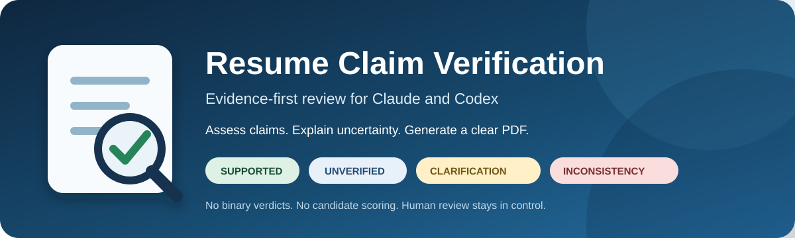
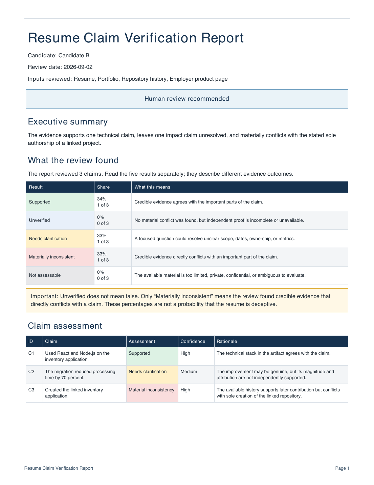

<div align="center">
  

  <br />

  
  
  
  

  **Review the evidence behind resume claims without turning uncertainty into an accusation.**

  [What it does](#what-it-does) · [See the output](#a-report-anyone-can-understand) · [Install](#install) · [Safety](#safety-by-design)
</div>

---

## Why this exists

A resume is a collection of claims, not a binary true-or-false document. Some claims have strong public evidence. Others involve confidential work, private employers, missing profiles, or ordinary date rounding.

Resume Claim Verification reviews each claim independently and clearly separates:

| Result | Plain-language meaning |
|---|---|
| 🟢 **Supported** | Credible evidence agrees with the important parts of the claim. |
| 🔵 **Unverified** | No material conflict was found, but independent proof is incomplete. |
| 🟡 **Needs clarification** | A focused question could resolve unclear scope, dates, ownership, or metrics. |
| 🔴 **Materially inconsistent** | Credible evidence directly conflicts with an important part of the claim. |
| ⚪ **Not assessable** | The available material is private, confidential, ambiguous, or too limited. |

> [!IMPORTANT]
> **Unverified does not mean false.** The plugin never converts missing evidence into a deception finding.

## What it does

```text
Resume + supplied evidence
          │
          ▼
   Extract atomic claims
          │
          ▼
 Compare internal consistency
          │
          ▼
 Research public sources only when authorized
          │
          ▼
 Evidence profile + follow-up questions + PDF
```

- Reviews employment, education, projects, authorship, technologies, responsibilities, and quantified impact.
- Handles candidates with no GitHub, no portfolio, confidential work, or limited public presence without penalizing them.
- Separates observations from inference and includes plausible alternative explanations.
- Produces focused interview questions for unresolved claims.
- Generates a polished PDF plus optional normalized JSON for later integrations.

## A report anyone can understand

The first page explains every percentage with both a count and a definition:

```text
34% Supported                1 of 3 claims
 0% Unverified               0 of 3 claims
33% Needs clarification      1 of 3 claims
33% Materially inconsistent  1 of 3 claims
 0% Not assessable           0 of 3 claims
```

These percentages describe the **distribution of evidence outcomes**. They are never presented as an “X% fake” score.

<div align="center">
  <a href="./plugins/resume-claim-verification/skills/resume-claim-verification/output/pdf/sample-resume-claim-verification-report.pdf">
    
  </a>
  <br />
  <sub>Click the preview to open the complete sample PDF.</sub>
</div>

## Install

### Codex plugin

Add this GitHub repository as a Codex marketplace, then install the plugin:

```bash
codex plugin marketplace add Krutarth22/resume-claim-verification
codex plugin add resume-claim-verification@krutarth22
```

Start a new Codex task after installation so the new skill is discovered.

### Standalone Claude or Codex skill

Clone the repository, then copy the bundled skill directory:

```bash
git clone https://github.com/Krutarth22/resume-claim-verification.git

# Claude Code
cp -R resume-claim-verification/plugins/resume-claim-verification/skills/resume-claim-verification \
  ~/.claude/skills/resume-claim-verification

# Codex
cp -R resume-claim-verification/plugins/resume-claim-verification/skills/resume-claim-verification \
  ~/.codex/skills/resume-claim-verification
```

## Use

Review only the supplied material:

```text
Use $resume-claim-verification to review this resume claim by claim.
Do not search public sources. Produce the final PDF report.
```

Allow job-relevant public research:

```text
Use $resume-claim-verification to review this resume and its supplied links.
You may search public, job-relevant professional sources. Produce the final PDF report.
```

## Safety by design

The validator rejects outputs containing binary fake flags, fraud determinations, candidate scores, rankings, protected-trait fields, or hiring recommendations.

The skill also requires:

- Candidate consent for private employment, education, reference, or background checks
- Clear separation between observed evidence and inference
- Human review of every material inconsistency
- Benign alternative explanations for unresolved or conflicting evidence
- An explicit limitation that the report does not establish fraud

## Develop and test

```bash
cd plugins/resume-claim-verification/skills/resume-claim-verification
python -m pip install -r requirements.txt
python -m unittest discover -s tests -v
```

Generate the included example:

```bash
python scripts/generate_report.py \
  tests/fixtures/mixed-evidence.json \
  output/pdf/sample-resume-claim-verification-report.pdf
```

The suite covers consistent evidence, mixed evidence, confidential work, no online profile, harmless date rounding, PDF generation, and prohibited decision fields.

---

<div align="center">
  Built for evidence-aware hiring workflows where uncertainty is explained—not weaponized.
</div>
